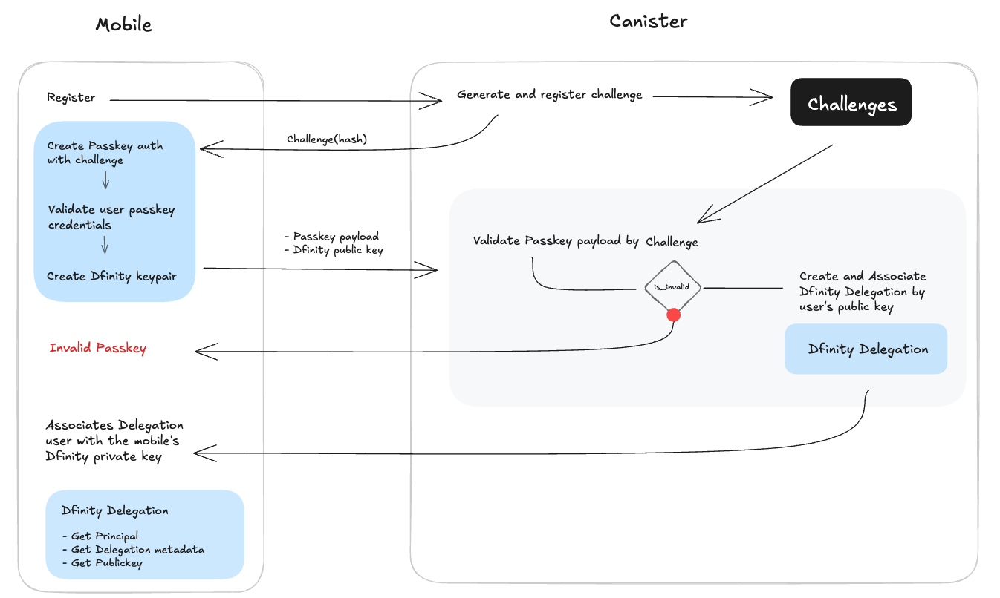

# ICP Authentication with Passkeys and Dfinity Delegation

This project implements an authentication flow using **Passkeys** and **Dfinity Delegation** to securely authenticate users in a decentralized manner.

## 📜 Overview

The authentication flow consists of **two main components**:  

- **Mobile**: Handles Passkey authentication, key generation, and delegation association.  
- **Canister**: Validates Passkey challenges and manages delegation creation.  

## 🔄 Authentication Flow

1. **Challenge Generation** (Canister):  
   - The canister generates and registers a challenge.  
   - The mobile app retrieves the challenge hash.  

2. **Passkey Authentication** (Mobile):  
   - The user authenticates with a Passkey.  
   - If successful, the mobile device generates a **Dfinity keypair**.  

3. **Validation and Delegation** (Canister):  
   - The Passkey payload and Dfinity public key are sent to the canister.  
   - If validation fails, an **Invalid Passkey** response is returned.  
   - If successful, a **Dfinity Delegation** is created and associated with the user’s public key.  

4. **Final Association** (Mobile):  
   - The delegation is linked with the mobile’s private key.  
   - The user gains access using the delegated identity.  

## 📌 Features

- **Decentralized authentication** with Passkeys.  
- **Secure delegation** using Dfinity’s identity model.  
- **Challenge-based validation** to prevent replay attacks.  

## 🖼️ Diagram

## 📖 More Details

For implementation details, refer to the project documentation.
[Documentation](https://unpaired-eth.github.io/docs-w3meet-auth/)