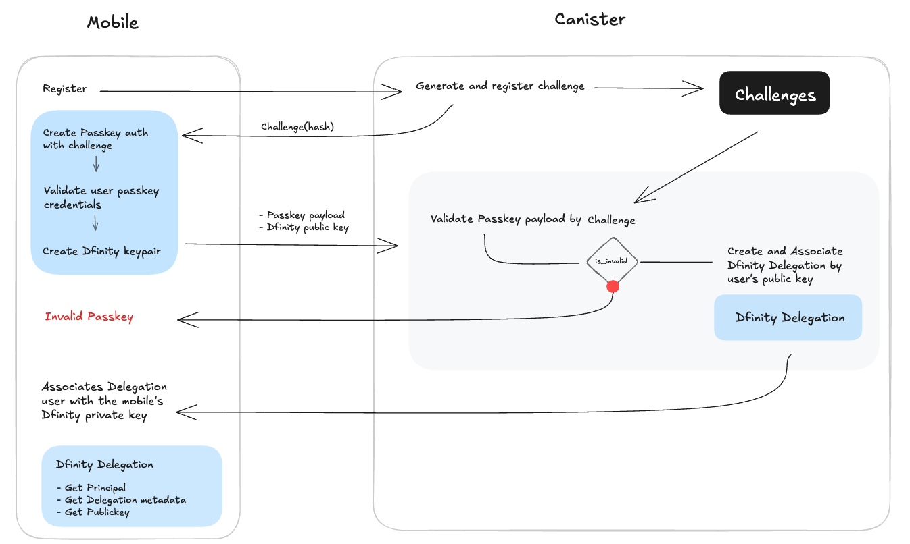

# ICP Authentication with Passkeys and Dfinity Delegation

Welcome to the documentation for the **ICP Authentication System** using **Passkeys** and **Dfinity Delegation**. This system enables decentralized and secure user authentication.

## 📌 Documentation Sections

- [Authentication Flow](authentication.md) - Step-by-step guide on how authentication works.
- [Dfinity Delegation](delegation.md) - Explanation of the delegation process.

## 🖼️ System Overview

The authentication system consists of two main components:

- **Mobile**: Manages Passkey authentication and Dfinity keypair generation.
- **Canister**: Validates authentication requests and handles delegation.

### 📊 Authentication Diagram



For detailed information, check the sections below.

## 🔑 Example: Using `react-native-w3meet-auth` for Authentication

The `react-native-w3meet-auth` library simplifies the implementation of authentication with Passkeys in a React Native app. Below is an example of how to set up and use the library to authenticate a user:

#### Code:

```javascript
import { Authenticator } from 'react-native-w3meet-auth';

const authenticator = Authenticator.config({
  host: 'http://127.0.0.1:4943',
  canisterId: 'bw4dl-smaaa-aaaaa-qaacq-cai',
  passkey: {
    user: {
      id: '1',
      name: 'Passkey Test',
      displayName: 'Passkey Test',
    },
    rp: {
      name: 'Passkey Test',
      id: 'vercel-endpoint.vercel.app',
    },
  },
});

export default function App() {
  const onPress = async () => {
    const result = await authenticator.signIn();
    console.log(result);
  };

  return <Button title="SignIn" onPress={onPress} />;
}
```